# Gateway challenges

### Core challenges
* **Audience (_faculty and students_)**:  Gateway must address two different audiences.
--

* **Context (_research and education_)**:  Faculty themselves have very different needs.
--

* **Content (_faculty training_)**:  Faculty need training not only in computational tools and quantitative/statistical concepts (which are underdeveloped in undergraduate curricula), but also in the pedagogical strategies in bringing these to the classroom.
--

### Cultural challenges
--

* **Isolation**:  Difficult for faculty to share teaching materials and strategies, due to fear of public scrutiny.
--

* **Recognition**:  Recognition of teaching scholarship in hiring, promotion and tenure is underdeveloped and widely variable.
--

* **Adoption**:  Adopting existing teaching materials from repositories is challenging as modifications are almost always necessary.

---

# QUBES: An Education Gateway
## .subheader[
Quantitative Undergraduate Biology Education and Synthesis
]
 
.center[

]

<!--
<blockquote>
QUBES is a community of math and biology educators who share resources and methods for preparing students to use quantitative approaches to tackle real, complex, biological problems.
</blockquote>
-->

.center[
## Supporting educators by advancing open and inclusive quantitative biology through the power of collective impact.
]

---

# QUBES: Education Gateway Components

.center[
 
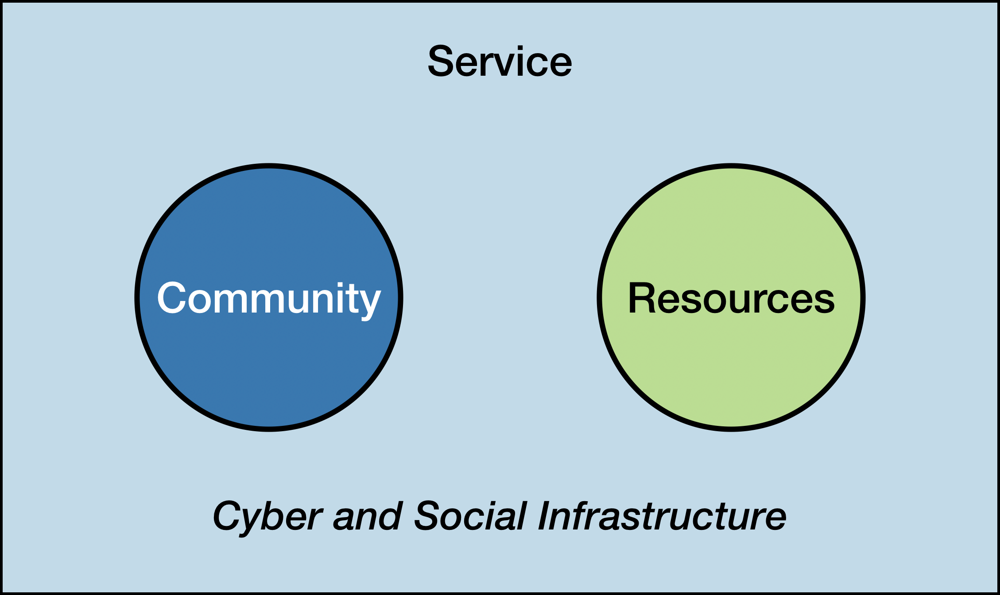
]

???

What is QUBES?

---

# QUBES: Education Gateway Components

.center[
 
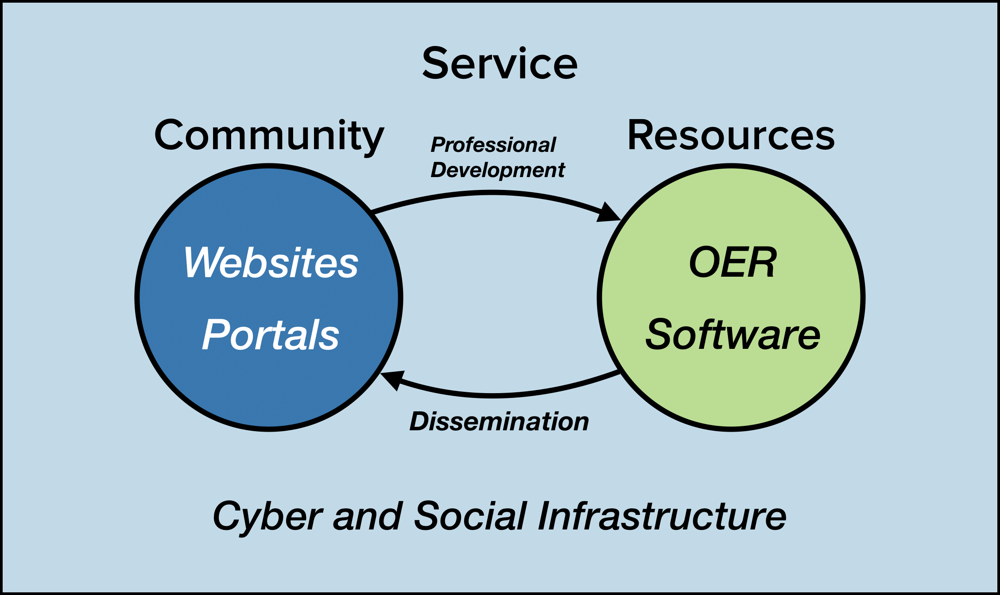
]

???

* Collaborative Community Workspaces
* Open Educational Resource Publishing Platform
* Computational Tools in the Classroom
* Professional Development

---

name: community

# Community
## .subheader[
Collaborative Community Workspaces
]

.thumbnail-top-right[]

.center[
.middle[
{{content}}
]
] 

---

template: community

# Education Projects

<a href="https://qubeshub.org/community/groups/partnerprojectsupport" target="_blank">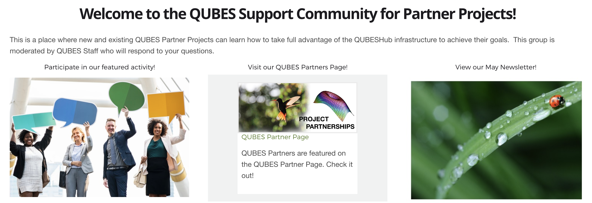</a>

[Click here to explore education projects on QUBES](https://qubeshub.org/community/groups/partnerprojectsupport)

---

template: community

# Education Wing of Research Organizations

<a href="https://qubeshub.org/community/groups/neon" target="_blank">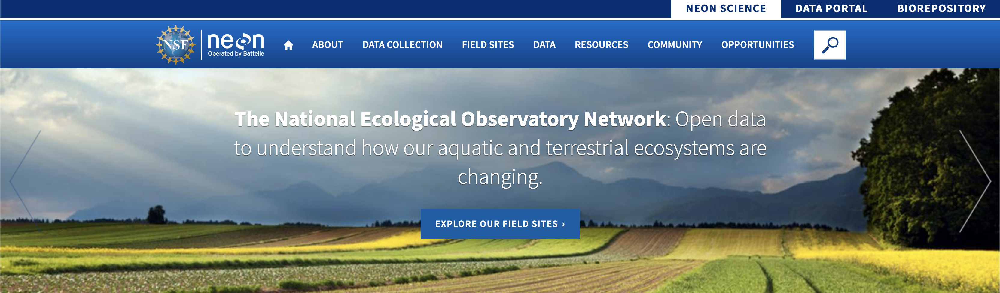</a>

[Click here to explore NEON on QUBES](https://qubeshub.org/community/groups/neon)

---

template: community

# Workshop Websites

<a href="https://qubeshub.org/groups/summer2019" target="_blank">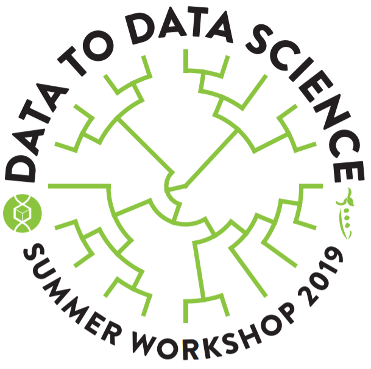</a>

[Click here to visit the QUBES/BioQUEST Summer 2019 Workshop](https://qubeshub.org/community/groups/summer2019)

---

name: resources-oer

# Resources
## .subheader[
Open Educational Resource Publishing Platform
]

.thumbnail-top-right[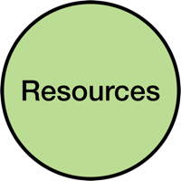]

.center[
.middle[
{{content}}
]
] 

---

template: resources-oer

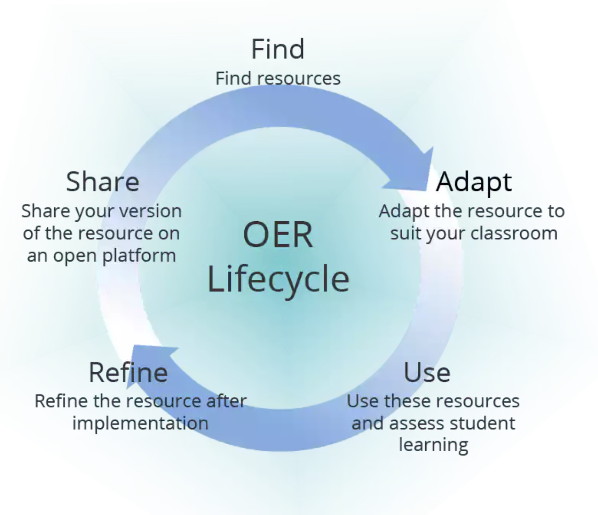

[Teaching Notes for Implementation of Gene Expression in Stem Cells](https://qubeshub.org/qubesresources/publications/331/1)
---

name: resources-software

# Resources
## .subheader[
Computational Tools in the Cloud
]

.thumbnail-top-right[]

.center[
.middle[
{{content}}
]
] 

---

# Resources
## .subheader[
Computational Tools in the Cloud
]

.thumbnail-top-right[]

 
.center[

]

.credit[Image credit: http://insights.speakwithageek.com/post/Top-Benefits-of-Cloud-Computing-in-Education]

---

# Resources
## .subheader[
Computational Tools in the Cloud
]

.thumbnail-top-right[]

## .subheader[
Jupyter and R Notebooks
]

 
 
.center[

]

.footnote[
[http://jupyter.org/](http://jupyter.org/) 
[Why I love R Notebooks](https://www.r-bloggers.com/why-i-love-r-notebooks-2/)
]

---

template: resources-software

 
### How can we get student’s manipulating and analyzing data as fast as possible (i.e. *doing science*), while at the same time creating a scaffold to scripting skills?

--

.center[
### How can we focus students' attention on meaningful disciplinary work while reducing the technical overhead to do that work?
]

---

# Resources
## .subheader[
Computational Tools in the Cloud
]

.thumbnail-top-right[]

## .subheader[
Serenity: Data Science in the Classroom
]

.center[

]

---

# Resources
## .subheader[
Computational Tools in the Cloud
]

.thumbnail-top-right[]

## .subheader[
Serenity: Data Science in the Classroom
]

.center[
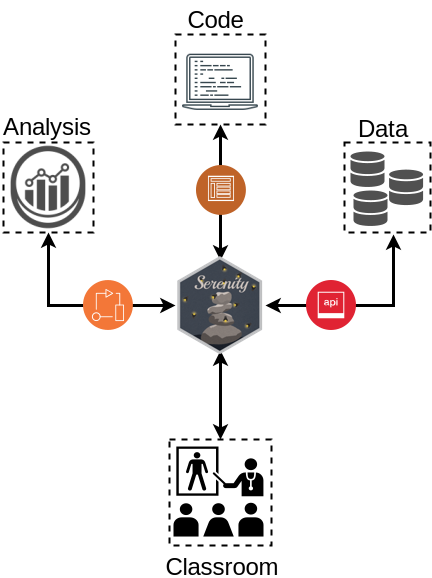
]

---

# Service
## .subheader[
Professional Development
]

.thumbnail-top-right[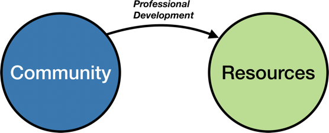]

 
### [Faculty Mentoring Networks](https://qubeshub.org/community/fmns#new) are:
* Online groups, typically 10-15 faculty members
--

* Focused on a specific topic or material
--

* Typically meet every two weeks over a period of several months
--

* Led by teams of expert content and pedagogy mentors

---

name: service-diss

# Service
## .subheader[
Dissemination
]

.thumbnail-top-right[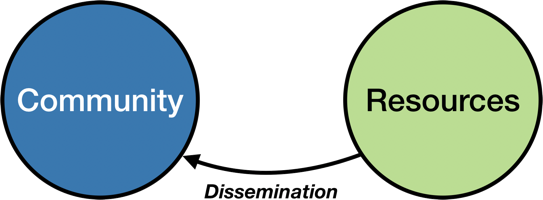]

.center[
.middle[
{{content}}
]
] 

---

template: service-diss

<a href="https://qubeshub.org/news/newsletter/row" target="_blank">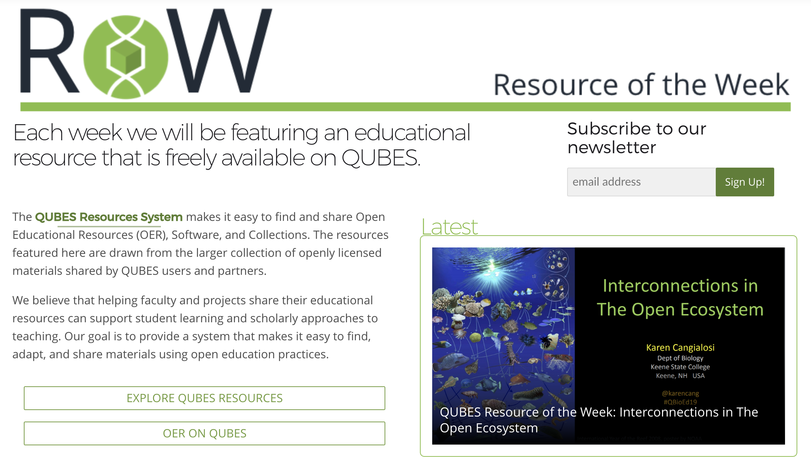</a>

[Visit the Resource of the Week page](https://qubeshub.org/news/newsletter/row)
---

template: service-diss

<a href="https://qubeshub.org/news/newsletter" target="_blank">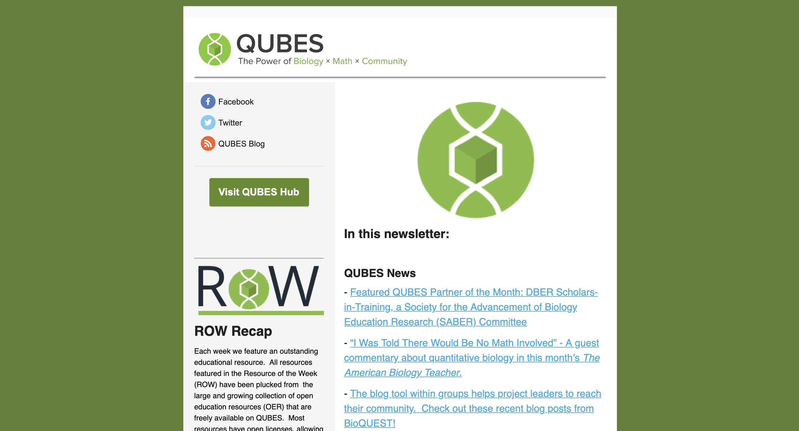</a>

[Browse QUBES newsletters](https://qubeshub.org/news/newsletter)
---

template: service-diss

### Summer Workshops

  
<a href="https://qubeshub.org/groups/summer2017" target="_blank">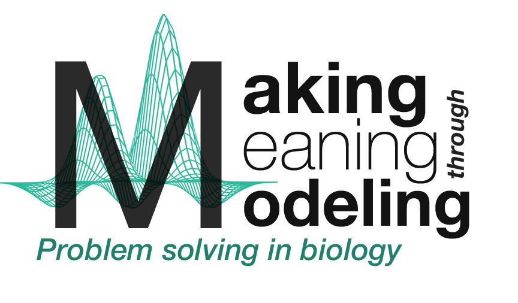</a>

<a href="https://qubeshub.org/groups/summer2018" target="_blank">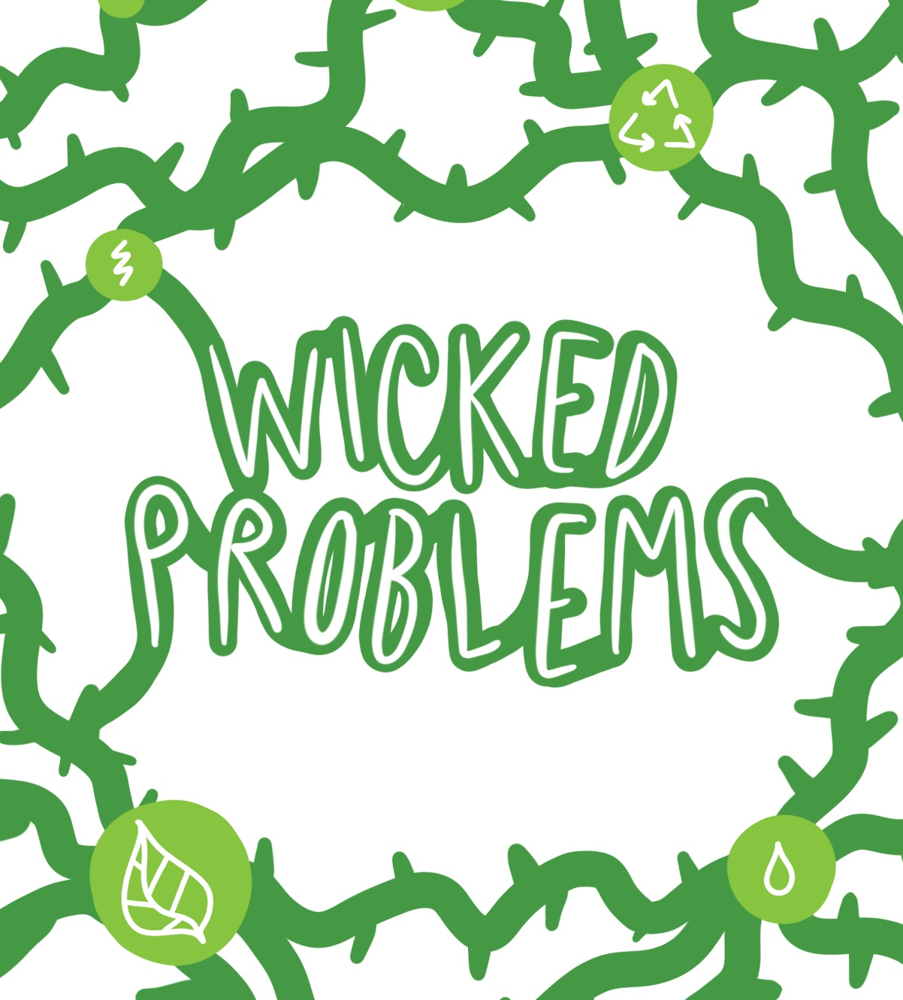</a>  
<a href="https://qubeshub.org/groups/summer2016" target="_blank">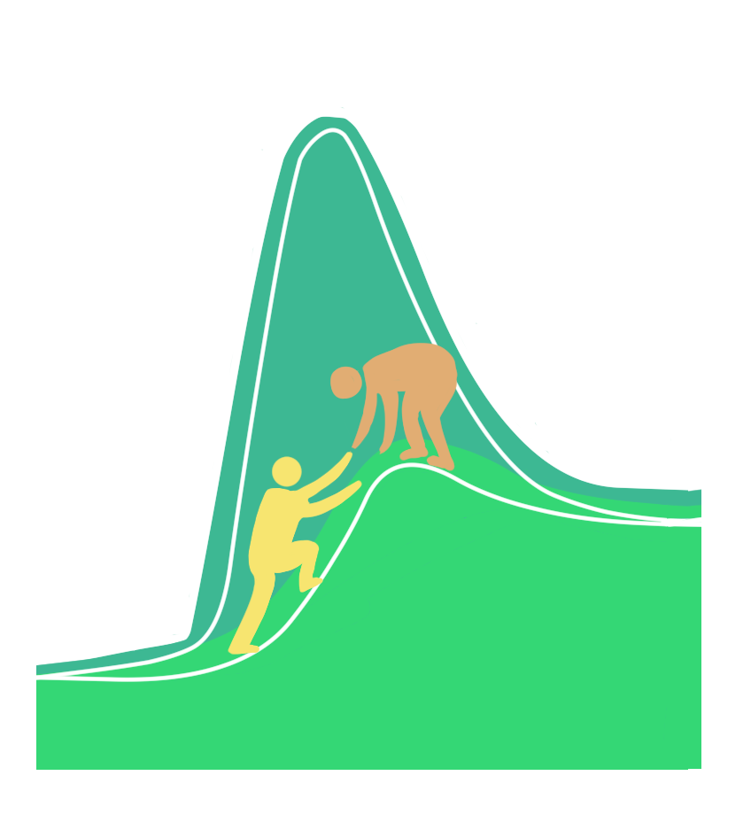</a>

---

# Case 1: Teaching Issues and Experiments in Ecology (TIEE)
## .subheader[
Reinvigorating an online education repository
]

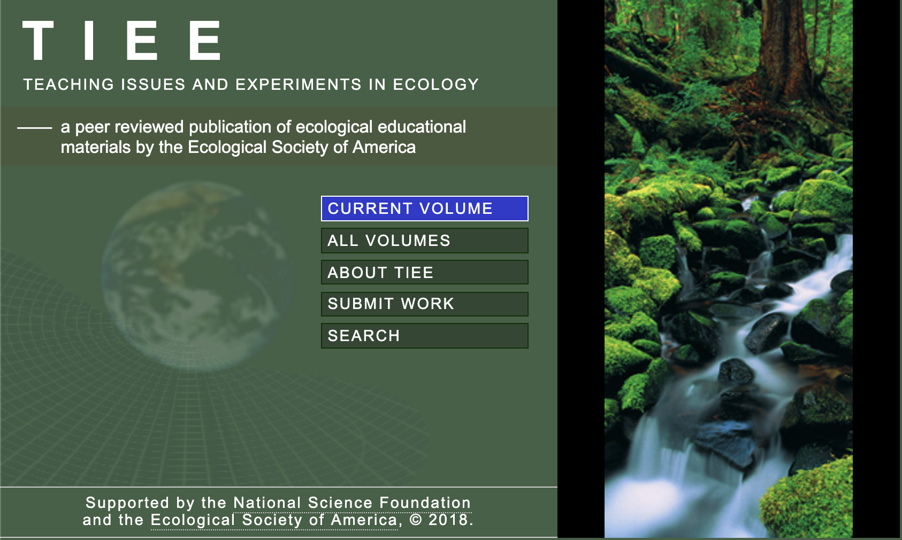

[Click here to browse ESA materials](https://qubeshub.org/community/groups/esa)

---

# Case 2: BIOMAAP
## .subheader[
Supporting an NSF funded education project
]

 

<a href="https://qubeshub.org/community/groups/biomaap" target="_blank">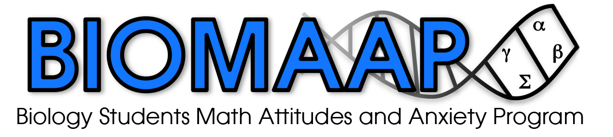</a>

[Click here to browse BIOMAAP materials](https://qubeshub.org/community/groups/biomaap)

.footnote[
NSF DUE-IUSE: Biology undergraduate Mathematics Attitudes and Anxiety Program (BioMAAP)
]
---

# Case 3: NIBLSE
## .subheader[
Incubating open educational resources
]

<a href="https://qubeshub.org/community/groups/niblse" target="_blank">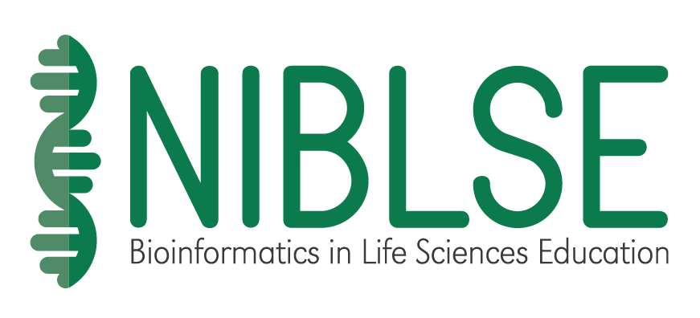</a>

[Click here to browse NIBLSE materials](https://qubeshub.org/community/groups/niblse)

.footnote[
NSF RCN-UBE: Network for Integrating Bioinformatics into Life Sciences Education (NIBLSE)
]

---

class: center

.thumbnail-top-left[]
.thumbnail-top-right[]

# Thank you!
### QUBES Leadership Team
.pull-left[
Kristin Jenkins 
Carrie Diaz-Eaton 
Jeremy Wojdak 
Hayley Orndorf 
Deborah Rook 
Elia Crisucci 
Adam Fagen 
]

.pull-right[
Jenny Kwan 
Bharath Chandra Reddy Barakam 
Alison Hale 
Arietta Fleming-Davies 
Gabriela Hamerlinck 
Nicole Chodkowski 
Elizabeth Hamman
]

       

.left[

Slides created via the R package <a href="https://github.com/yihui/xaringan">xaringan</a>.

This material is based upon work supported by the National Science Foundation under DBI 1346584, DUE 1446269, DUE 1446258, and DUE 1446284.  Any opinions, findings, and conclusions or recommendations expressed in this material are those of the author(s) and do not necessarily reflect the views of the National Science Foundation.

]